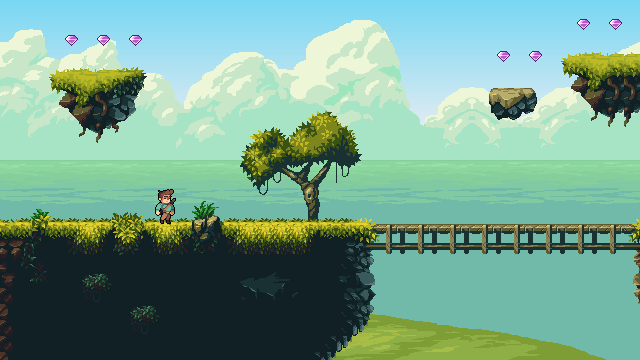

# Tilengine python platformer
This project aims to teach actual game mechanics using the free, cross-platform [Tilengine retro graphics engine](http://www.tilengine.org) under python.



## Features
The features implemented so far are:
* Two layer parallax scrolling
* Sprite and tileset animations
* Raster effects for sky gradient color, cloud motion, sea water *linescroll* and hills movement on a single background layer
* Basic list of game entities (actors)
* Three character states: idle, running and jumping
* Tileset attributes in Tiled editor: *type* and *priority*
* Player/level interaction: the player can jump on platforms, get blocked by walls and pick gems
* Inertial control and acceleration
* Slopes
* Active game entities management
* Define game entities (enemies, etc) inside tmx object layer and load into a list
* Enemy behavior and spawn active enemies from loaded entities list
* Enemies can hurt player and make it bounce
* Basic sound effects with SDL_Mixer library

## Prerequisites
This project depends on three external components that must be installed separately:

### Tilengine
http://www.tilengine.org

Each supported platform has its own methods for build or install binaries, please follow method of your own platform.

### SDL2 and SDL2_Mixer
https://www.libsdl.org/

SDL2 (Simple DirectMedia Layer) is an open-source, cross-platform library for managing windows, user input, graphics and sound. Both tilengine and this project use SDL2 internally. You must install the runtime binaries into your system.

**Windows and OSX:**

Download prebuilt binaries here:

https://www.libsdl.org/download-2.0.php

https://www.libsdl.org/projects/SDL_mixer/

**Debian-based linux:**

Open a terminal window and install directly from package manager:
```
sudo apt install libsdl2-2.0-0 libsdl2-mixer-2.0-0
```

### SDL2 python binding
http://pysdl2.readthedocs.io

You must also install the binding for using SDL2 from python language. From a terminal window type the following command:
```
pip install pysdl2
```

## Source code organisation
This is a breif overview about modules breakdown in `/src` directory

|Module                                     |  Role
|-------------------------------------------|---------------------
|[`platformer.py`](src/platformer.py)       | Main module: init and game loop
|[`tilengine.py`](src/tilengine.py)         | Tilengine binding for python
|[`raster_effect.py`](src/raster_effect.py) | Tilengine raster effects for background
|[`game.py`](src/game.py)                   | Game backbone, global instances
|[`actor.py`](src/actor.py)                 | Base class for all game entities
|[`player.py`](src/player.py)               | Player class
|[`opossum.py`](src/opossum.py)             | Terrestrial enemy class
|[`eagle.py`](src/eagle.py)                 | Flying enemy class
|[`score.py`](src/score.py)                 | Pop-up animation of score class
|[`effect.py`](src/effect.py)               | Generic one-shot animation class
|[`world.py`](src/world.py)                 | World/level class
|[`UI.py`](src/ui.py)                       | HUD UI class (score, time...)
|[`rectangle.py`](src/rectangle.py)         | Simple helper class for rectangles
|[`sound.py`](src/sound.py)                 | Sound effects manager

## Acknowledge
Graphic assets are copyrighted and owned by their original authors
* Backgrounds created by ansimuz: https://ansimuz.itch.io/magic-cliffs-environment
* Player character created by Jesse M: https://jesse-m.itch.io/jungle-pack
